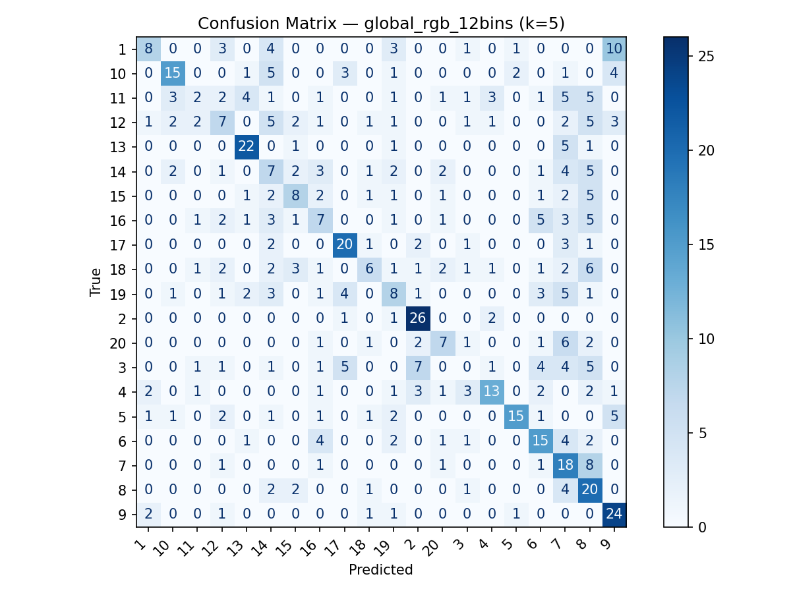
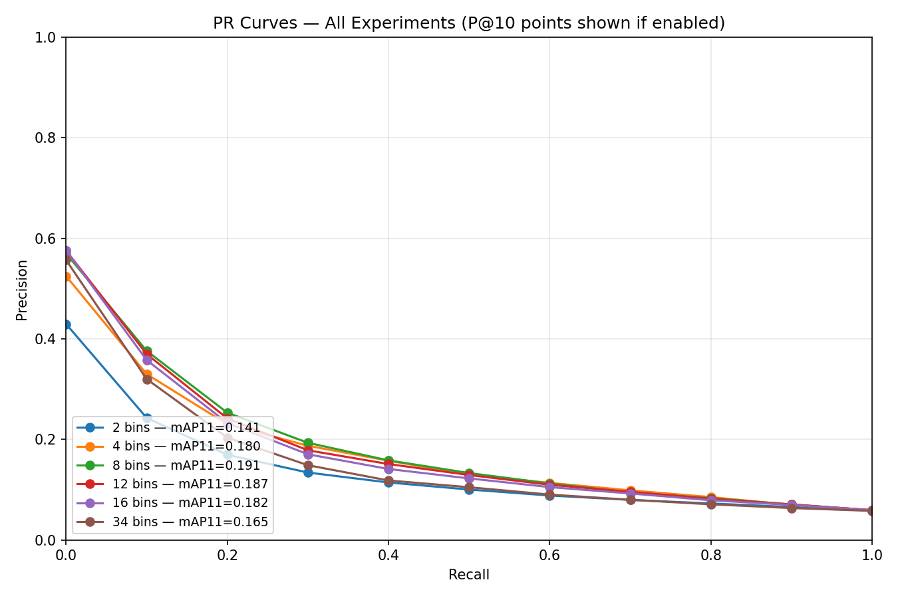
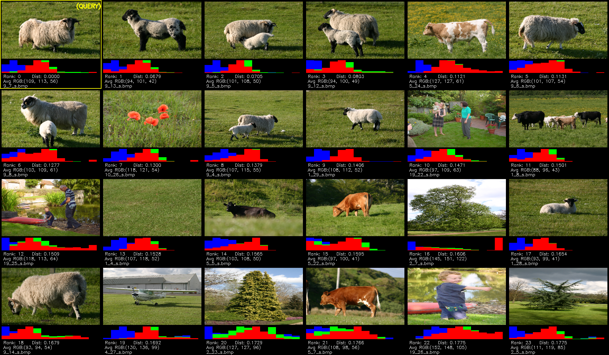
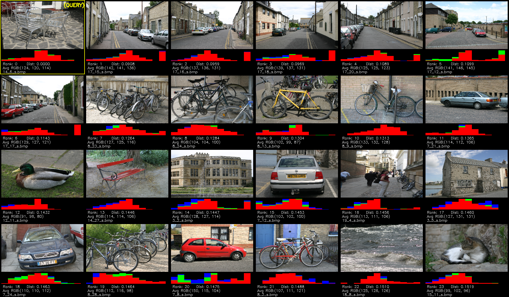
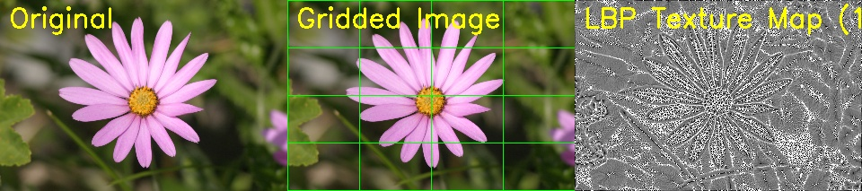
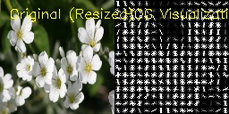

### Computer Vision and Pattern Recognition Surrey University MsC Project Assigment










### 1. Guide on how to use Docker: [Docker Guide](https://www.xanderwiles.com/pages/Docker_Guide/).

### 2. Run the Bin Optimization

```
python3 optimize_bins.py
```

### 3. Compute Global Colour Histogram 
```  
python3 cvpr_computedescriptors.py --bins 12 --clean
```

### 4. Generate Visual Examples

```
python3 cvpr_visualsearch_batch.py
```


### 5. Compute Spatial Features Colour
```
python3 compute_spatial_features.py \
  --feature_type color \
  --grid_size 4 \
  --color_bins 12 \
  --output_dir ./  \
  --feature_type color \
  --grid_size 4 \
  --color_bins 12 \
  --output_dir ./  
```


### 6. Compute Spatial Features Texture
```
python3 compute_spatial_features.py \
  --feature_type texture \
  --grid_size 4 \
  --lbp_points 8 \
  --lbp_radius 1 \
  --output_dir ./
  ```

### 7. Compute Hog Features 
```
python3 compute_hog_features.py
```


### 8. Compute Distance Evaluation 

```
python3 batch_evaluate_distance.py \
  --base_descriptor_dir ./descriptors \
  --distance_metrics l1 l2 chi2 cosine \
  --num_queries 200 \
  --num_visual_queries 5 \
  --top_k 10 \
  --seed 123
```

### 9. Compute PCA Mahalanobis

```
python3 compute_pca_mahalanobis.py \
  --descriptor_dir ./descriptors/pca_spatial_color_4x4_12bins \
  --output_dir ./pca_mahalanobis_results_spatial_color_32d \
  --n_components 32 \
  --num_queries 10
```

### 10. Compute PR Curves and Confusion Matrix Tables

```
  python evaluate_system.py --topk 10 --knn 5 --with-prk-points
```